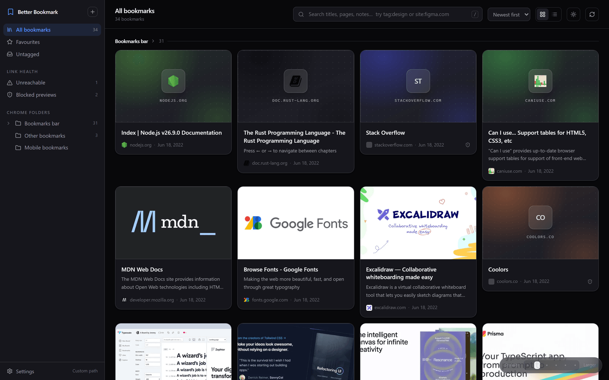
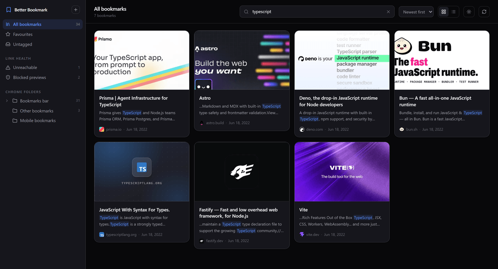

# Better Bookmark

[](https://github.com/nischal-masand/Better-bookmark/actions/workflows/ci.yml)
[](LICENSE)

A self-hosted bookmark manager that mirrors your Chrome bookmarks — folder structure intact — and gives them thumbnails, full-text search, tags and notes. Everything runs on this machine. Nothing is sent to any service.



---

## Quick start

You need **Node 20.11 or newer** and Chrome. Then:

```bash
npx better-bookmark
```

and open **http://127.0.0.1:8765**. That is the whole install — no clone, no build. `Ctrl+C` stops it; running the same command again starts it with your library intact. `npx better-bookmark --help` lists the options.

The first launch imports your Chrome bookmarks and starts fetching previews in the background — the grid fills in live, no refresh needed. A library of ~240 bookmarks takes a couple of minutes for the whole pass; larger ones scale roughly linearly, four pages at a time.

Runs on Windows, macOS and Linux, from the same package.

### Where your library lives

One SQLite file plus cached thumbnails and icons, in your per-user data folder:

| OS      | Folder                                                 |
| ------- | ------------------------------------------------------ |
| Windows | `%APPDATA%\better-bookmark`                            |
| macOS   | `~/Library/Application Support/better-bookmark`        |
| Linux   | `~/.local/share/better-bookmark` (or `$XDG_DATA_HOME`) |

Copy the folder to back it up; delete it for a clean slate. It is deliberately _not_ stored next to the program: `npx` runs from npm's cache, which npm clears on its own schedule, and your tags and notes should not go with it. `BB_DATA_DIR` overrides the location.

### Running from source

To work on the code, or to run it without npm's registry in the loop:

```bash
git clone https://github.com/nischal-masand/Better-bookmark.git
cd Better-bookmark
npm install
npm run build
npm start
```

Installing the dev dependencies takes about 250 MB. A checkout keeps its library in `./data` inside the project rather than the per-user folder above. `npm run dev` runs the API on 8765 and Vite on **http://localhost:5173** with hot reload.

---

## How syncing works

The server reads Chrome's own `Bookmarks` file, wherever your platform keeps it:

| OS      | Path                                                              |
| ------- | ----------------------------------------------------------------- |
| Windows | `%LOCALAPPDATA%\Google\Chrome\User Data\<Profile>\Bookmarks`      |
| macOS   | `~/Library/Application Support/Google/Chrome/<Profile>/Bookmarks` |
| Linux   | `~/.config/google-chrome/<Profile>/Bookmarks`                     |

Every profile with a Bookmarks file is found automatically — you should not need to set anything. `BB_BOOKMARKS_PATH` is there if you keep Chrome somewhere unusual.

It watches that file and re-imports whenever Chrome saves it, so a bookmark you add in Chrome shows up here **within about three seconds**. No extension to install, and it works whether or not Chrome is running.

Sync is **one-way — Chrome to the app.** Chrome's file is opened read-only and never written to, so there is no way for this app to corrupt your bookmarks. That also means tags, notes and favourites you add here live only here.

Chrome's GUIDs are the identity, so the app tracks a bookmark correctly through renames and moves. Three cases are worth knowing:

| In Chrome                 | Here                                                                                                          |
| ------------------------- | ------------------------------------------------------------------------------------------------------------- |
| Rename or move a bookmark | Follows it. Tags and notes stay attached.                                                                     |
| Delete a bookmark         | Moves to **Archive**, not deleted. Your tags and notes are kept.                                              |
| Re-add a URL you deleted  | Reclaims the archived entry — the old tags and notes come back, even though Chrome assigned a brand-new GUID. |

Switch profiles under **Settings**; every profile with a Bookmarks file is detected automatically.

---

## Previews

For each bookmark the server fetches the page **directly from the site itself** and reads its `og:image`, title, description and favicon, then stores a resized WebP locally.

Pages without a preview image get a generated card instead: a gradient derived from the site's own brand colour (extracted from its favicon, ignoring the background so you get the logo's colour rather than white), with the favicon and domain on top. The result is a grid that reads as designed rather than as a wall of grey placeholders.

Pages that block automated requests still get their favicon and colour where possible, and the card carries a badge you can hover for the reason.

---

## Link rot

Every failed fetch is sorted into one of three buckets, each with its own sidebar entry:

|                      | Meaning                                     | What to do                                                           |
| -------------------- | ------------------------------------------- | -------------------------------------------------------------------- |
| **Dead links**       | 404, 410, or the domain no longer resolves  | Nothing is coming back. Clear them out.                              |
| **Unreachable**      | Timeout, TLS failure, connection reset, 5xx | Ambiguous. Worth retrying later.                                     |
| **Blocked previews** | 403, 429 and friends                        | The page is fine — it just will not serve a robot. Leave them alone. |

The split is the point. Lumping a Cloudflare 403 in with a 404 would make the cleanup list untrustworthy, so only **Dead links** is presented as safe to delete, and only it gets the red badge. That view has a **Remove all** button for clearing the lot in one go, and everything it removes is recoverable from **Hidden**.

---

## Keeping things out of the library

Not every Chrome bookmark belongs in a browsable wall of thumbnails.

- **Hide one bookmark** — the eye button on a card, `e` on the keyboard, or Remove in the detail panel.
- **Exclude a whole folder** — the eye button that appears beside it in the sidebar.

Either way the item stops appearing in every view, in search, and in folder counts — and stays gone across syncs, because the rule is stored against Chrome's own GUID rather than against a path that a rename could break. Excluding a folder is a privacy instruction too: **those sites are never fetched again**, so nothing in an excluded folder is ever contacted.

Nothing is destroyed. Hidden bookmarks keep their tags and notes and are listed under **Hidden**; excluded folders are listed in **Settings**, each with a Restore button.

---

## Adding, deleting and moving

**Add** with the `+` button. The link is saved here and enriched like any other.

**Delete** and **move** change Chrome too. They are applied by a small companion extension — see below. Hiding stays available as the non-destructive option: it only affects this library and never touches Chrome.

### Selecting several at once

Click any card's checkbox to start a selection. From there:

- **Click** toggles, **Shift-click** selects everything in between
- `x` toggles the focused card, **Ctrl/Cmd+A** selects everything loaded, **Esc** clears
- The bar along the bottom applies **hide, favourite, tag, move to a folder** or **delete** to the lot

Move and delete are the ones that reach Chrome; the rest are local.

---

## Two-way sync with Chrome

Deleting or moving a bookmark here does the same in Chrome, through a companion extension.

### Why an extension

Chrome keeps its bookmarks in memory and rewrites its `Bookmarks` file on its own schedule. Anything this app wrote into that file would be silently overwritten the next time Chrome saved — or leave the file looking corrupt. The `chrome.bookmarks` API is the supported way in, and an extension is the only thing that can call it.

### Two ways to apply changes

Changes are queued the moment you make them, and applied by whichever route is available:

|                   | Needs               | Works while Chrome runs      |
| ----------------- | ------------------- | ---------------------------- |
| **The extension** | a one-time install  | yes — applied within seconds |
| **Apply now**     | Chrome fully closed | no                           |

Nothing is lost either way. While a change is waiting, a banner at the top of the library says so and offers both routes; the bookmark is hidden here but still in Chrome until it lands.

### Installing the extension

1. Open `chrome://extensions`
2. Turn on **Developer mode** (top right)
3. **Load unpacked** → pick the extension folder

You do not need to go looking for that folder: the banner shows its exact path with a copy button, and **Settings** shows a green dot once the extension connects. Installed through `npx`, it lives in the data folder (for example `%APPDATA%\better-bookmark\extension`), copied there on every start so it survives npm clearing its cache and stays current when you upgrade; from a checkout it is `extension/` in the project.

Once installed, the extension's bookmark icon in Chrome's toolbar is also the quickest way in: click it and hit **Open library** (it jumps to the library tab if one is already open). Underneath, a single line shows whether Chrome and the library are in sync, with a **Sync now** link that pushes any waiting changes to Chrome and re-reads Chrome's bookmarks.

### Apply now — the no-extension route

**Apply now** in the banner writes the queued changes straight into Chrome's `Bookmarks` file. It only runs with Chrome fully closed, because Chrome keeps bookmarks in memory and would overwrite the file from there on its next save.

It is not a blind file edit:

- The original is **backed up** to `data/backups/` first
- The file is **re-signed with Chrome's own MD5 checksum** — the implementation is verified against your real bookmarks file in the test suite, so Chrome accepts the result rather than treating it as externally modified
- A delete whose **URL no longer matches** the node in the file is refused
- The new file is parsed and re-checked before it replaces the original, and written via temp-file-and-rename so a crash mid-write cannot truncate it

### What it does, and does not, do

The extension holds one permission, `bookmarks`, and talks only to `127.0.0.1:8765`. It never reads page content or browsing history. It also relays Chrome's own bookmark events back, which is why a bookmark you add in Chrome appears here instantly rather than on the next three-second poll.

Deletes are careful by design:

- A delete is **hidden first and only destroyed once Chrome confirms** the node is gone. If Chrome refuses, the bookmark comes back with its tags and notes intact and the failure is reported in Settings, where you can retry or discard it.
- The extension **verifies the URL** against the live node before removing anything, and falls back to searching by URL if Chrome has renumbered its node ids.
- A short-lived tombstone stops a sync landing in the gap before Chrome flushes its file from re-importing what you just deleted.

### Security

The API now deletes bookmarks, so it rejects any cross-origin request that is not from the extension or the app's own page. A web page cannot forge an `Origin` header, which closes the CSRF hole a loopback server with destructive endpoints would otherwise leave open.

---

## Privacy

This is the whole point of the project, so it is worth being precise:

- The server binds to **127.0.0.1 only**. Nothing on your network can reach it.
- The **only** outbound requests are to the bookmarked sites themselves, to read their title, preview image and icon. There is no favicon proxy, no metadata service, no telemetry, no account, no CDN — a favicon service would otherwise be handed your entire bookmark list one URL at a time.
- Fonts are the ones already on your system; the built bundle contains no external URLs.
- **Settings → Pause fetching previews** stops all outbound traffic while still syncing from Chrome. **Never fetch these sites** takes a list of domains to leave alone entirely.
- All data lives in one folder — the per-user data folder under `npx`, `./data/` in a checkout (see [Where your library lives](#where-your-library-lives)). Delete it for a clean slate.

---

## Searching

The search box runs over titles, descriptions, URLs, your notes, **and the readable text of the pages themselves** — so you can find a bookmark by something it said, not just by its title. Matches are highlighted in context.



Fastify is in those results because the word appears in its page body, not in its title or URL.

Filters can be mixed with free text:

| Filter    | Example                                                                                                         |
| --------- | --------------------------------------------------------------------------------------------------------------- |
| `tag:`    | `tag:design`                                                                                                    |
| `site:`   | `site:github.com`                                                                                               |
| `folder:` | `folder:"Bookmarks bar/Resources"`                                                                              |
| `is:`     | `is:favorite`, `is:untagged`, `is:dead`, `is:blocked`, `is:unreachable`, `is:local`, `is:hidden`, `is:archived` |

So `shader tag:reading site:github.com` does what it looks like.

## Keyboard

| Key          | Action                                                  |
| ------------ | ------------------------------------------------------- |
| `/`          | Focus search                                            |
| `j` / `k`    | Move between bookmarks                                  |
| `Enter`      | Open in a new tab                                       |
| `o`          | Show details                                            |
| `f`          | Toggle favourite                                        |
| `e`          | Hide from the library                                   |
| `x`          | Add to the selection                                    |
| `Ctrl/Cmd+A` | Select everything loaded                                |
| `Esc`        | Clear the selection, close a panel, or clear the search |

The toolbar's right-hand side holds grid/list and a **group by folder** toggle; card size is a stepped slider in the bottom-right corner of the window, with six stops from 200px to 500px. Viewing a folder shows everything nested under it, which for "Bookmarks bar" is most of the library at once; grouping breaks that back into a section per subfolder, with the loose links gathered under _Not in a subfolder_. Every choice is remembered.

---

## Configuration

Settings that matter day to day are in the UI. These environment variables cover the rest:

| Variable            | Default       | Purpose                                         |
| ------------------- | ------------- | ----------------------------------------------- |
| `BB_PORT`           | `8765`        | Port to listen on                               |
| `BB_DATA_DIR`       | see above     | Where the database and images live              |
| `BB_BOOKMARKS_PATH` | auto-detected | Point at a specific Bookmarks file              |
| `BB_PAUSE_ENRICH`   | —             | `1` disables all outbound fetching              |
| `BB_API_ONLY`       | —             | `1` serves only the API, leaving the UI to Vite |

The server serves the built UI whenever `web/dist` exists, so it needs no environment set up to run from a shortcut.

---

## Never starting the server by hand

> **Windows, from a checkout.** The autostart scripts are PowerShell and live in the repository,
> so they need a clone (see [Running from source](#running-from-source)). Everywhere else —
> macOS, Linux, or Windows via `npx` — point your login-items mechanism (Task Scheduler,
> a `launchd` plist, a systemd user unit) at `npx better-bookmark`. Contributions welcome.

From a checkout, run this once:

```bash
npm run autostart:install
```

From then on the server starts by itself whenever you sign in, with no console window, and `http://127.0.0.1:8765` in your Chrome bookmarks bar just works. The installer also starts it immediately, so there is nothing to do afterwards.

It picks the best mechanism it is allowed to use:

|                      | Needs admin | Behaviour                                                                        |
| -------------------- | ----------- | -------------------------------------------------------------------------------- |
| **Scheduled task**   | yes         | Fully invisible, and restarts itself if it ever crashes.                         |
| **Startup shortcut** | no          | A PowerShell window blinks for a moment at sign-in, then the server runs hidden. |

It falls back to the shortcut automatically. To get the task instead, run the same command from an **elevated** terminal — it will replace the shortcut.

Starting a second copy is harmless: the server notices the port is taken, says so and exits.

```bash
npm run autostart:uninstall
```

removes whichever one is installed and stops the server. Your `data/` folder is never touched.

### Making it feel like an app

In Chrome, open `http://127.0.0.1:8765`, then **⋮ → Cast, save and share → Install page as app**. You get a standalone window with no address bar, pinnable to the taskbar.

---

## Tests

```bash
npm test
```

All four suites run against a scratch **copy** of `server/test/fixtures/Bookmarks`, a small checked-in file in Chrome's own format. That means they run anywhere — including CI runners with no Chrome installed — and your own Chrome data is not involved at all.

To run them against your real profile instead:

```bash
BB_TEST_REAL_PROFILE=1 npm test
```

That still works on a copy, so Chrome is never written to. It is worth doing before a release: real bookmark files are messier than any fixture, and one assertion — that this project's checksum implementation reproduces Chromium's — can only be proved against a file Chrome actually wrote, so it is skipped in fixture mode.

Between them the suites cover the import, the move/delete/re-add round trip (including that notes survive it), folder renames, that hiding and folder exclusions survive a re-sync, recovery from a half-written file, and the Windows-specific case where Chrome replaces the Bookmarks file by renaming a temp file over it.

`ops.test.ts` drives the whole Chrome write-back protocol against the real route handlers with a stand-in for the extension: queued deletes, deletes Chrome refuses, batch moves, batch delete, and the race where a sync runs before Chrome has flushed a deletion to disk.

`writer.test.ts` covers the no-extension route: that the checksum implementation reproduces Chrome's own, that deletes and moves land correctly in the file, that the rewritten file still parses and re-imports identically, that a backup is taken, and that a URL mismatch refuses to delete.

---

## Layout

```
server/src/
  chrome/    profile discovery, Bookmarks JSON parsing, WebKit timestamps
  sync/      reconciler (guid matching, archive, resurrect) and the file watcher
  enrich/    fetch queue, metadata extraction, images, readable text
  lib/       http, colour extraction, ICO decoding, search, queries
  routes/    the JSON API and the event stream
  test/      four suites plus the shared harness and the Bookmarks fixture
web/src/     React UI
extension/   the companion Chrome extension (load unpacked)
scripts/     autostart install/uninstall and the hidden launcher (Windows)
data/        SQLite database + cached thumbnails and icons (gitignored)
```

---

## Not included

A scheduled re-check of link health — statuses are set when a page is fetched, so use Refetch to refresh one. Edge and Firefox import. Renaming or re-ordering bookmarks from here (the op queue takes new kinds easily; only `delete` and `move` are wired up). Writing to Chrome while it is running without the extension, which is not possible safely. Autostart on macOS and Linux.

---

## Contributing

See [CONTRIBUTING.md](CONTRIBUTING.md). Bug reports and pull requests are welcome.

## License

[MIT](LICENSE) © Nischal Masand
